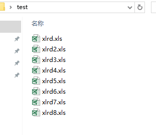
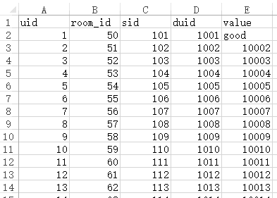
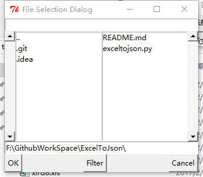
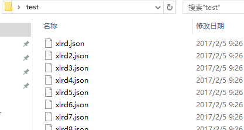
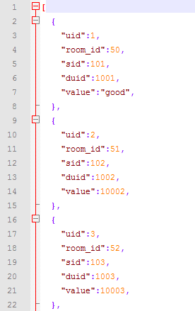

### ExcelToJson

---

#### 概述
ExcelToJson 为 python 转换 excel 为 json 格式的工具

#### 简介

ExcelToJson 提供一个简单的界面（Tkinter），实现单个和批量转换的功能，其中批量转换使用多线程加快转换效率。
批量转换制定文件夹自动获取文件夹下为 '.xls' 的 excel 格式文件进行转换，转换后的json文件名与excel保持一致，并生成在同一目录下

#### 模块

ExcelToJson类说明

| 函数 | 说明 |
| :-------------- | :------------ |
| createWidgets | 初始化窗体 |
| singleConvert | 单个转换（点击执行） |
| batchConvert | 批量转换（点击执行） |
| getFilesFromDir | 获取文件夹下制定格式的文件列表 | 
| getThreadNum | 计算开启的线程数 |
| splitList | 根据线程数分配任务列表 |
| doConvert | 批量转换函数 |
| doConvertBase | 转换核心函数 |


#### 使用

```
    ## 运行程序
    python exceltopython.py
```

#### 截图













#### LICENSE

软件遵循MIT开源协议

#### 说明

欢迎大家加入此项目继续完善此项目